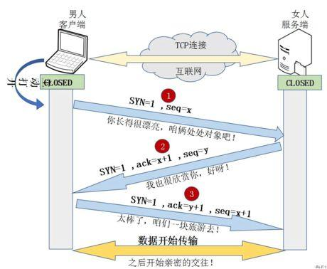

# 三次握手
1. 第一次握手：由客户端向服务端发送连接请求 SYN 报文，该报文段中包含自身的数据通讯初始序号，请求发送后，客户端便进入 SYN-SENT 状态。
2. 第二次握手：服务端收到连接请求报文段后，如果同意连接，则会发送一个包含了 ACK 和 SYN 报文信息的应答，该应答中也会包含自身的数据通讯初始序号（在断开连接的“四次挥手”时，ACK 和 SYN 这两个报文是作为两次应答，独立开来发送的，因此会有四次挥手），服务端发送完成后便进入 SYN-RECEIVED 状态。
3. 第三次握手：当客户端收到连接同意的应答后，还要向服务端发送一个ack确认报文。客户端发完这个报文段后便进入 ESTABLISHED 状态，服务端收到这个应答后也进入 ESTABLISHED 状态，此时连接建立成功。

# 为什么需要第三次握手
“第三次握手”是客户端向服务器端发送数据，这个数据就是要告诉服务器，客户端有没有收到服务器“第二次握手”时传过去的数据。若发送的这个数据是“收到了”的信息，接收后服务器就正常建立TCP连接，否则建立TCP连接失败，服务器关闭连接端口。由此减少服务器开销和接收到失效请求发生的错误。
# 四次挥手

1. 第一次挥手：客户端认为自己这边的数据已经全部发送完毕了，于是发送一个 FIN 用来关闭客户端到服务端的数据传输，发送完成以后，客户端进入 FIN_WAIT_1 状态。
2. 第二次挥手：服务端收到客户端发送回来的 FIN 以后，会告诉应用层要释放 TCP 链接，并且发送一个 ACK 给客户端，表明已经收到客户端的释放请求了，不会再接受客户端发来的数据，自此，服务端进入 CLOSE_WAIT 的状态。 
3. 第三次挥手：服务端如果此时还有未发送完的数据可以继续发送，发送完毕后，服务端也会发送一个释放连接的 FIN 请求用来关闭服务端到客户端的数据传送，然后服务端进入 LAST_ACK 状态。 
4. 第四次挥手：客户端接收到服务端的 FIN 请求后，发送最后一个 ACK 给服务端，接着进入 TIME_WAIT_2 状态，该状态会持续 2MSL（最大段生存期，指报文段在网络中生存的时间，超时会被抛弃） 时间，若该时间段内没有服务端的重发请求的话，客户端就进入 CLOSED 状态.服务端在收到应答消息后，也会进入 CLOSED 状态，至此完成四次挥手的过程，双方正式断开连接。

# https和http

### http

- 明文传输，内容可能被窃取
- 不验证身份，遭遇伪装
- 不验证报文完整性，拦截
- HTTP 的端口号是 80，HTTPS 的端口号是 443
### https == http + ssl/tls
- ssl/tls 是独立于http的安全协议
- 数字证书：将服务器公钥放在数字证书（由数字证书认证机构颁发）中，只要证书是可信的，公钥就是可信的。客户端先向服务器端索要公钥，然后用公钥加密信息，服务器收到密文后，用自己的私钥解密。
- 混合加密：在通信建立前采用非对称加密的方式交换「会话秘钥」，后续就不再使用非对称加密。在通信过程中全部使用对称加密的「会话秘钥」的方式加密明文数据。
- 摘要算法确认报文没有 被篡改

