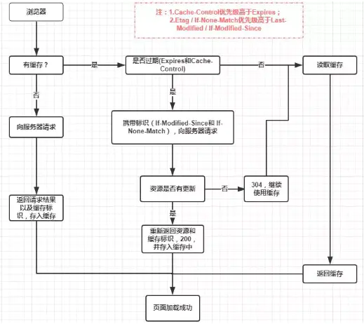
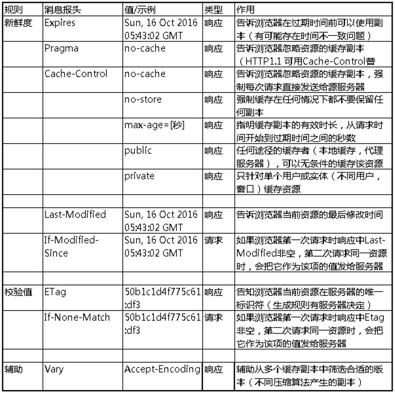

# 浏览器缓存机制

 Web 缓存是指一个 Web 资源（如 html 页面，图片，js，数据等）存在于 Web 服务器和客户端（浏览器）之间的副本。
# 缓存的好处
1. 减少请求次数，降低服务器的压力
2. 减少网路延迟，提高性能
# 缓存机制

## 强缓存
> 不会向服务器发送请求，直接从缓存中读取资源，在chrome控制台的Network选项中可以看到该请求返回200的状态码，并且Size显示from disk cache或from memory cache。强缓存可以通过设置两种 HTTP Header 实现：Expires 和 Cache-Control。
- 浏览器发起请求之前，先去缓存里查看是否命中强缓存，命中直接返回数据
## 协商缓存
> 强缓存失效后，浏览器携带缓存标识发起请求，
- 当强缓存没有命中时，会通过request header 首部字段判断是否命中协商缓存

